# Make better choices while coding

- **Use OkHttp over HttpUrlConnect**

  HttpUrlConnect suffers from [quite some bugs](https://android-developers.blogspot.in/2011/09/androids-http-clients.html). [Okhttp](https://square.github.io/okhttp/) solves them in a more elegant manner. [[Reference Link]](https://corner.squareup.com/2013/05/announcing-okhttp.html)

* **Reference local `aar` files as below [[Stackoverflow Ref](http://stackoverflow.com/a/28816265/2745762)]**

  ```gradle
    dependencies {
       implementation(name:'nameOfYourAARFileWithoutExtension', ext:'aar')
    }
    repositories {
       flatDir {
          dirs 'libs'
       }
    }
  ```

* **Use [Pidcat](https://github.com/JakeWharton/pidcat) for a better log reading experience**

* **Use some Version Control System(VCS) like [Git](https://git-scm.com/)**

* **Use [ClassyShark](https://github.com/google/android-classyshark)**

  It is a standalone tool for Android Devs used to browse any Android executable and show important info such as class interfaces and members, dex counts and dependencies

* **Use [Stetho](https://github.com/facebook/stetho)**

  Debug your android apps using Chrome Dev Tools. Includes tools like Network Monitor, Shared Preference explorer etc.

* **Use [Battery Historian](https://github.com/google/battery-historian)**

  A tool to analyze battery consumers using Android "bugreport" files.

* **Always use a constant version value like "1.2.0"**

  Avoid using `+` when specifying the version of dependencies.

  - Keeps one secured from unexpected API changes in the dependency.
  - Avoids doing an extra network call for the checking latest version of each dependency on every build.

* **Use [Handler instead of a TimerTask](http://www.mopri.de/2010/timertask-bad-do-it-the-android-way-use-a-handler/)**
* **[Do not use your own personal email for Google Play Developer Account](https://www.reddit.com/r/Android/comments/2hywu9/google_play_only_one_strike_is_needed_to_ruin_you/)**
* **Use Vectors instead of PNG**

  If you do **have** to use png, compress them. Take a look at [TinyPNG](https://tinypng.com).

* **Use proguard**

  ```gradle
  android {
    ...
    buildTypes {
        release {
            minifyEnabled true
            proguardFiles getDefaultProguardFile('proguard-android.txt'), 'proguard-rules.pro'
        }
    }
  }
  ```

  [[Read more from the manual here](https://www.guardsquare.com/en/proguard/manual/usage)]

* **Use shrinkResources**

  ```gradle
  android {
    ...
    buildTypes {
        release {
            shrinkResources true
            minifyEnabled true
            ...
        }
    }
  }
  ```

* **Follow the below [rule to have faster gradle builds](https://medium.com/@skaliakoudas/decreasing-build-times-by-decreasing-gradle-memory-requirements-7fcafc6d98ea#.otnm0ofb6)**

  ```gradle
  Gradle memory >= Dex memory + 1Gb
  ```

* **Split your apk using gradle when using Native code, do not bundle all of em together and ship!.. coz that will make you evil**

  ```gradle
  defaultConfig {
      ...

      ndk {
        abiFilters "armeabi", "armeabi-v7a", "mips", "x86"
      }
    }

  //Split into platform dependent APK
  splits {
    abi {
      enable true
      reset()
      include 'armeabi', 'armeabi-v7a', 'mips', 'x86' //select ABIs to build APKs for
      universalApk false //generate an additional APK that contains all the ABIs
    }
  }

  // map for the version code
  project.ext.versionCodes = ['armeabi': 1, 'armeabi-v7a': 2, 'mips': 5, 'x86': 8]

  // Rename with proper versioning
  android.applicationVariants.all { variant ->
    // assign different version code for each output
    variant.outputs.each { output ->
      output.versionCodeOverride =
          project.ext.versionCodes.get(output.getFilter(com.android.build.OutputFile.ABI), 0) *
              1000000 +
              android.defaultConfig.versionCode
    }
  }
  ```

* **Learn about some architecture such as MVP or Clean**

* **Try to understand and follow TDD (Test Driven Development)**

* **To force re-download of dependencies**

  ```gradle
  ./gradlew --refresh-dependencies
  ```

* **To exclude a certain task from being run by gradle**

  Suppose you want to exclude the task `javaDoc` then use `-x` option followed by the task name, i.e `javaDoc` in this case.

  ```gradle
  ./gradlew clean build -x javaDoc
  ```

* **To have the each subproject script name match that of the project name**

  Then add this line in settings.gradle

  ```gradle
  rootProject.children.each{
    it.buildFileName = it.name + '.gradle'
  }
  ```

  **[Checkout more gradle tips here](https://github.com/shekhargulati/gradle-tips)**

* **Follow the DRY principle**
  DRY = Do not Repeat Yourself

* **[Package by Feature, not layers](https://medium.com/the-engineering-team/package-by-features-not-layers-2d076df1964d)**

* **[Learn about Dependency Resolution](http://crushingcode.co/the-curious-case-of-dependency-conflicts/)**

  With the speed android dependencies update, sooner or later you are going to encounter some sort of dependency conflict. The solution is making use of Dependency Resolution. [Official Reference](https://docs.gradle.org/current/dsl/org.gradle.api.artifacts.ResolutionStrategy.html)

* **Use different package name for non-release builds**

  ```gradle
    android {
        buildTypes {
            debug {
                applicationIdSuffix '.debug'
                versionNameSuffix '-DEBUG'
            }

            release {
                // ...
            }
        }
    }
  ```

* **[Find and STOP leaking memory in your android app](http://blog.nimbledroid.com/2016/09/06/stop-memory-leaks.html)**

* **[If you’re creating a gradient in xml with a part being completely transparent, be really careful when using `@android:color/transparent`](https://android.jlelse.eu/android-dev-tip-3-99da754151ad#.clbqzz3zh)**

* **[Follow a standard naming convention for your resources](http://jeroenmols.com/blog/2016/03/07/resourcenaming/)**

* **Make use of custom gradle tasks in your build.gradle files**

  Android uses Gradle as its build system, which actually allows one to make a lot of things easy by creating tasks to automate things.
  [This reddit post enlists a lot of such useful gradle scripts](https://www.reddit.com/r/androiddev/comments/3ig3gm/show_us_your_gradle_tasks)

* **Use a proper .gitignore in your Android Projects, [Check it here](/android.gitignore)**

* **[Use LeakCanary to detect memory leaks in your app](https://github.com/square/leakcanary)** - Its a memory leak detection library for Android and Java.

* **Speed up your gradle builds in Android Studio 2.3+**

  - Switch to gradle 3.4.1

    Run this inside your project folder to update your gradle wrapper

    ```bash
    ./gradlew wrapper --gradle-version 3.4.1 --distribution-type all
    ```

  - Set the below property in your global `gradle.properties` file

    ```
    android.enableBuildCache=true
    ```

* **Stop a running gradle build process**

  ```bash
  ./gradlew -stop
  ```

* **Enable gradle to automatically download missing platforms in android sdk**

  Set the below property in your global `gradle.properties` file

  ```
  android.builder.sdkDownload=true
  ```

  > This is an experimental option and it only downloads build tools and platforms, but doesn't actually update Google or Support repository [[Bug Ref]](https://code.google.com/p/android/issues/detail?id=212309)

* **Donot include both `jcenter()` & `mavenCentral()` in your `build.gradle` file**

  JCenter is a superset of MavenCentral. [[Ref tweet]](https://twitter.com/molsjeroen/status/791606774210199553)

* **Clear your gradle cache if you think that bundled support and google play services lib in android sdk are inconsistent**

  - Goto `~/.gradle/caches/` and delete everything inside the `cache` folder.
  - Open SDK Manager and resync all support libs and google play services
  - Next re-sync your project
  - Everything should become consistent and functional.

* **Setup Android Studio to fail build if code contains `//STOPSHIP`** [[Ref Link]](https://www.reddit.com/r/androiddev/comments/5c8b0a/i_know_android_studio_allows_you_to_make_custom/d9uhdzt/)

  To enable the `//STOPSHIP` lint check, in your `build.gradle`

  ```gradle
  android {
  ...
      lintOptions {
          abortOnError true
          fatal 'StopShip'
      }
  }
  ```

  If you have a `//STOPSHIP` comment in your code, this will cause an error to be thrown when a release apk is generated.

  > You can turn on //STOPSHIP highlighting in Android Studio (isn't enabled by default) in
  >
  > `Preferences` > `Editor` > `Code Style` > `Inspections`.
  >
  > Search for STOPSHIP to find the correct setting.

* **Use [`alfi`](https://github.com/cesarferreira/alfi) to find the gradle dependency statement for a library**

  > Its basically the command line version of [Gradle, Please](gradleplease.appspot.com) which is a web hosted.

  - Run

    ```bash
    alfi name_of_library
    ```

  - Copy the desired library
  - Paste in your build.gradle

* **Use [`dryrun`](https://github.com/cesarferreira/dryrun) to test a library directly**

  - Just Run

    ```bash
    dryrun REMOTE_GIT_URL
    ```

* **Output unit tests directly to the console** [[Ref Link]](https://medium.com/@cesarmcferreira/mastering-the-terminal-side-of-android-development-e7520466c521#.1cw4bto7f)

  > A small neat trick to see Android unit tests logging results as they happen in the terminal.

  ```gradle
  android {
      ...
      testOptions.unitTests.all {
        testLogging {
          events 'passed', 'skipped', 'failed', 'standardOut', 'standardError'
          outputs.upToDateWhen { false }
          showStandardStreams = true
        }
      }
    }
  ```

* **Make your builds faster by building offline** [[Ref Link]](https://medium.com/@cesarmcferreira/mastering-the-terminal-side-of-android-development-e7520466c521#.1cw4bto7f)

  > The `--offline` flag tells gradle to always use dependency modules from the cache, regardless if they are due to be checked again. When running offline, gradle will never attempt to access the network to perform dependency resolution. If required modules are not present in the dependency cache, build execution will fail.

  - Assembling develop debug at full speed:

    ```gradle
    ./gradlew assembleDevelopDebug --offline
    ```

  - Running your unit tests at full speed:

    ```gradle
    ./gradlew test --offline
    ```

* **Use an abtracted [Logger](/Logger.java) class**

* **If you want to automatically initialize your library, use a Content Provider** [[Read how Firebase does it - Ref Link]](https://firebase.googleblog.com/2016/12/how-does-firebase-initialize-on-android.html)

* **Reduce installed app size with `"android:extractNativeLibs:false"` in `<application>`** [[Ref Link]](https://medium.com/@wkalicinski/smallerapk-part-8-native-libraries-open-from-apk-fc22713861ff#.bajqmlshi)

  > This will essentially prevent the system from creating a second copy of the .so files and fix the System.loadLibrary call so it’s able to find and open native libs straight from the APK, no code changes on your part required.

* **Selectivily execute a specific method in Android Studio** [[Ref Link]](https://twitter.com/tasomaniac/status/820019068140945408)

  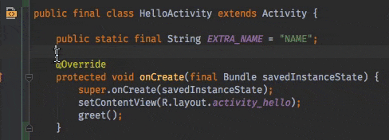

* **Did you get one of these Google Play Developer Policy Violation Emails? Worry not, generate a Privacy Policy for your android app** [[Ref ink]](https://medium.com/@ali.muzaffar/did-you-get-one-of-these-google-play-developer-policy-violation-emails-6c529ceb082d#.f10upj3fy)

  - Take a look at [App Privacy Policy Generator](https://app-privacy-policy-generator.firebaseapp.com/), a web app to generate a generic privacy policy for your app.

* **Define a variable at build time**
  In your `build.gradle`

  ```gradle
  android{
    defaultConfig {
      ...
      buildConfigField "String", "SERVER_ENDPOINT", '"http://www.myendpoint.com"'
      buildConfigField "int", "FOO", "52"
      buildConfigField "boolean", "LOG", "false"
      ...
    }
  }
  ```

  and then use it in code as `BuildConfig.SERVER_ENDPOINT`, `BuildConfig.FOO`,`BuildConfig.LOG`

* **Calculate the version code and version name in your `build.gradle` **manually**_, based of version values_**
  In your app's `build.gradle`

  ```gradle
  versionMajor = 0
  versionMinor = 0
  versionPatch = 0
  versionBuild = 1

  verCode = versionMajor _ 1000000 + versionMinor _ 10000 + versionPatch \* 100 + versionBuild
  verName = "${versionMajor}.${versionMinor}.${versionPatch}"

  // Use
  android{
    defaultConfig {
          ...
          versionCode verCode
          versionName verName
          ...
    }
  }
  ```

- **Calculate the version code and version name in your `build.gradle` automatically, based on git information**

  > Note: These functions go specifically inside the app's `build.gradle` and cannot be used with `ext`.

  In your app's `build.gradle`

  ```gradle
  // Version code is calculated as the number of commits from last commit on master
  def getVersionCode = { ->
    try {
      def code = new ByteArrayOutputStream()
      exec {
        commandLine 'git', 'rev-list', 'HEAD', '--count'
        standardOutput = code
      }
      return Integer.parseInt(code.toString().trim())
    } catch (exception) {
      return "1";
    }
  }

  // Version name is Last Tag Name + No. of commits form last Tag +  short git sha
  def getVersionName = { ->
    try {
      def stdout = new ByteArrayOutputStream()
      exec {
        commandLine 'git', 'describe', '--tags', '--dirty'
        standardOutput = stdout
      }
      return stdout.toString().trim()
    } catch (exception) {
      return "0.0.0.1";
    }
  }

  // Use
  android{
    defaultConfig {
      ...
      versionCode getVersionCode()
      versionName getVersionName()
      ...
    }
  }
  ```

* **Get the date of build as a variable**
  In your app's `build.gradle`

  ```gradle
  // Get the date of build
  def getDateOfBuild = { -> // ISO 8601 time format
    return new Date().format("yyyy-MM-dd'T'HH:mm'Z'").toString().trim()
  }

  // then use it as a variable in BuildConfig
  android{
    defaultConfig {
      ...
      buildConfigField "String", "DATE_OF_BUILD", "\"${getDateOfBuild()}\""
    }
  }
  ```

* **Get the Git SHA as a variable**
  In your app's `build.gradle`

  ```gradle
  // Get the last Git Short Hash
  def getGitHash = { ->
    def stdout = new ByteArrayOutputStream()
    exec {
      commandLine 'git', 'rev-parse', '--short', 'HEAD'
      standardOutput = stdout
    }
    return stdout.toString().trim()
  }

  // then use it as a variable in BuildConfig
  android{
    defaultConfig {
      ...
      buildConfigField "String", "GIT_SHA", "\"${getGitHash()}\""
    }
  }
  ```

  > Have a look at the [Paperwork Project](https://github.com/zsoltk/paperwork), which generates build info for your Android project without breaking incremental compilation

* **Activity LifeCycle** [[Ref Link](https://www.bignerdranch.com/blog/android-activity-lifecycle-onStop/)]

  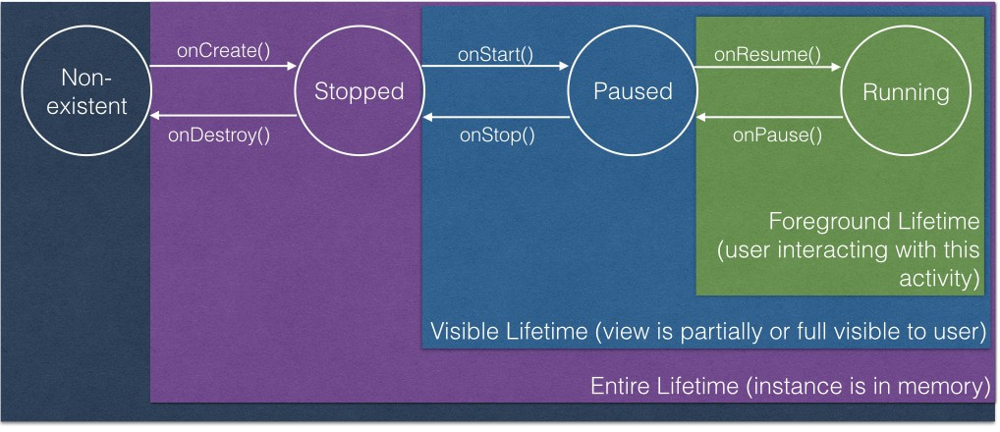

* **Tip about `onSaveInstanceState()`**  
  `onSaveInstanceState()` is called **_only when the OS decides to kill the `Activity` instance_**. It will not be called when Activity is explicitly killed i.e User pressed back button or `finish()` is called from code.

* **[If you are into building Android Libraries, then read here for more tips](https://android.jlelse.eu/things-i-wish-i-knew-when-i-started-building-android-sdk-libraries-dba1a524d619)**

* **[Read about whats in an APK here](http://crushingcode.nisrulz.com/whats-in-the-apk/)**

* **[Input some text in an editfield in a running emulator from your keyboard ](http://fragmentedpodcast.com/episodes/77/)**

  ```gradle
  adb shell input text "keyboard text"
  ```

* **Use [`areNotificationsEnabled()`](<https://developer.android.com/reference/android/support/v4/app/NotificationManagerCompat.html#areNotificationsEnabled()>) from [`NotificationManagerCompat`](https://developer.android.com/reference/android/support/v4/app/NotificationManagerCompat.html#areNotificationsEnabled) to detect whether your users blocked your Notifications** [[Ref Link](https://twitter.com/tasomaniac/status/851888395152392193/photo/1)]

* **Don't hard-code encryption keys, a simple grep for `"Ljavax/crypto"` reveals them in bytecode** [[Ref Link](https://twitter.com/molsjeroen/status/851708885782204417)]

* **Intents have a limited payload size (1Mb), don't serialize and attach entire file to it** [[Ref Link](https://twitter.com/molsjeroen/status/851353828905627648)]

* **Always copy a file before sending it as intent URI. Receiving app could edit it & send a canceled result** [[Ref Link](https://twitter.com/molsjeroen/status/851354820883689473)]

* **Use `http://` as scheme for app deeplinks, they are more universal & when app not installed drive users to a domain you own** [[Ref Link](https://twitter.com/molsjeroen/status/851349683440111616)]

* **Use below to display your app launch time** [[Ref Link](https://twitter.com/molsjeroen/status/851367439996784640)]

  ```bash
  adb shell am start -W <packagename>/. <activityname>
  ```

* **[Use Java 8 features by adding `sourceCompatibility` & `targetCompatibility` to your build.gradle file](https://developer.android.com/studio/preview/features/java8-support.html)**

  ```gradle
  android {
    ...
    compileOptions {
      sourceCompatibility JavaVersion.VERSION_1_8
      targetCompatibility JavaVersion.VERSION_1_8
    }
  }
  ```

* **[Setup a gradle task to archive apks and proguard files on build, for backup purposes](https://medium.com/pressure-labs/a-new-devs-guide-to-google-play-sanity-4-a-groovy-script-to-save-them-all-456a12672886)**

  ```gradle
  task deployApks(type:Copy) {
      description = "Copies APKs and Proguard mappings to the deploy directory"
      def appName = "<app_name>";
      def versionDir = android.defaultConfig.versionName+"_"+android.defaultConfig.versionCode;

      println("Copies APK and Proguard to " + versionDir)

      from 'build/outputs/mapping/release/'
      include '**/mapping.txt'
      into '../.admin/deploy/' + versionDir
      rename ('mapping.txt', "${versionDir}-mapping.txt")

      from ('.') {
          exclude '**/build', '**/src'
      }

      include '*.apk'
      into '../.admin/deploy/' + versionDir
      rename ('app-release.apk', "${appName}-${versionDir}.apk")
  }
  ```

* **[Use activity-alias or your launcher icons will disappear when renaming/moving your MainActivity](https://medium.com/@Mauin/the-case-of-disappearing-launcher-icons-657c3663b9d3)**

* To enable `aapt2` set below in gradle properties

  ```gradle
  android.enableaapt2=true
  ```

* To testout doze mode, trigger it using `adb` [[Ref Link](https://developer.android.com/training/monitoring-device-state/doze-standby.html#testing_doze)

  ```bash
  adb shell dumpsys deviceidle force-idle
  ```

* Thumb rule regarding setting `compileSdkVersion`, `minSdkVersion` and `targetSdkVersion`

  > `minSdkVersion` (lowest possible) <= `targetSdkVersion` == `compileSdkVersion` (latest SDK)

- Google released an option to include OSS license activity in your app, use that to attribute credits to the OSS libs in your app [[Ref Link](https://developers.google.com/android/guides/opensource)]

  > [Checkout a working example here](https://github.com/nisrulz/android-examples/tree/master/OSSLicenseActivity)

- Make Android Studio render `<merge>` layouts correctly by specifying the layout type with the tools:parentTag attribute [[Ref Link](https://twitter.com/m_evans10/status/907635918550511617)]

  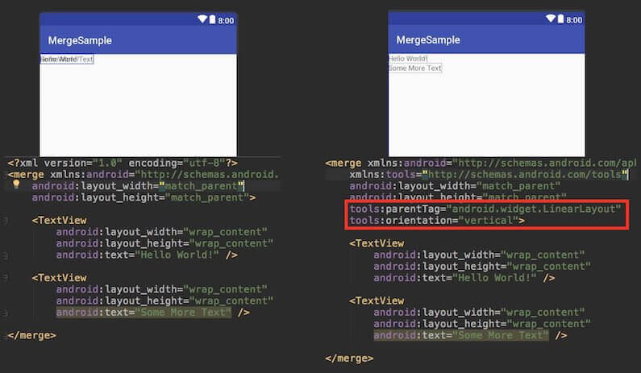

- Checkout the Background Execution Limits on Android Oreo and update your app to work with the restrictions [[Ref Link](https://medium.com/exploring-android/exploring-background-execution-limits-on-android-oreo-ab384762a66c)]

- To take good screenshots with clean status bar use the [**Demo Mode**](https://android.googlesource.com/platform/frameworks/base/+/master/packages/SystemUI/docs/demo_mode.md) in Android [[Ref Link](https://android.jlelse.eu/clean-your-status-bar-like-a-pro-76c89a1e2c2f)]

  - Steps

    1.  Enable Demo Mode

        ```bash
        adb shell settings put global sysui_demo_allowed 1
        ```

    1.  Enable/disable icons by running the right command

        ```bash
        // display time 12:00
        adb shell am broadcast -a com.android.systemui.demo -e command clock -e hhmm 1200

        // Display full mobile data without type
        adb shell am broadcast -a com.android.systemui.demo -e command network -e mobile show -e level 4 -e datatype false

        // Hide notifications
        adb shell am broadcast -a com.android.systemui.demo -e command notifications -e visible false

        // Show full battery but not in charging state
        adb shell am broadcast -a com.android.systemui.demo -e command battery -e plugged false -e level 100
        ```

    1.  Run app and take screenshots

    1.  Exit demo mode once you are done

        ```bash
        adb shell am broadcast -a com.android.systemui.demo -e command exit
        ```

- To record video of your android device [[Ref Link](https://dev.to/aneesahammed/best-way-to-record-your-screen-on-android)]

  ```bash
  adb shell && screenrecord /sdcard/download/fileName.mp4
  ```

  > Hit `Ctrl+C` to exit/stop recording
  >
  > Recorded video file is saved at the location mentioned in the command on the device itself.

- Use Dao inheritance to reduce the amount of boilerplate code [[Ref Link](https://gist.github.com/florina-muntenescu/1c78858f286d196d545c038a71a3e864)]

- Instead of using `getActivity()` in fragment, keep a habit of getting context from `onAttach()`. [[Ref Link](https://twitter.com/ravi_rupareliya/status/920881340245073920)]

- Avoid setting a background in every view/fragment as it likely causes overdraw. [[Ref Link](https://twitter.com/molsjeroen/status/923543967978881025)]

- `View.getWidth() = 0?` That's because your view hasn't been layout yet, use globallayoutListener to know layout done. [[Ref Link](https://twitter.com/molsjeroen/status/923542864877047808)]

- Android never kills activities, it only kills processes. When low memory the lowest priority ranked will be killed.[[Ref Link](https://twitter.com/molsjeroen/status/923510846696951809)]

- [Use `.([filename].java:[line])` in your log statements to make them clickable in Android Studio and Intellij IDEA.](https://medium.com/@tauno/android-studio-pro-tip-go-to-source-from-logcat-output-f13bf46411b5)

- Use `-whyareyoukeeping class com.jeroenmols.MyClass` to figure out why certain a class wasn't removed.[[Ref Link](https://twitter.com/molsjeroen/status/905713748173881345)]

- Use certificate pinning to resist impersonation by attackers using mis-issued or otherwise fraudulent certificates, when making requests from your app. [[Ref Link](https://dev.to/mplacona/certificate-pinning-in-android)]

- Do download the latest emulator using CLI

  ```
  cd <android_sdk>/tools/bin
  ./sdkmanager --channel=3 emulator
  ```

  To check the version of emulator, use `./sdkmanager --channel=3 emulator`

- **[Checkout some tricks when using Android Strings in XML](https://android.jlelse.eu/android-strings-xml-tips-tricks-52b0c820cf7a)**

- Cleanup your Gradle caches by deleting files not accessed within the last month [[Ref Link](https://github.com/gradle/gradle/issues/2304)]

  ```
  find ~/.gradle -type f -atime +30 -delete
  find ~/.gradle -type d -mindepth 1 -empty -delete
  ```

  > To check the size of your gradle cache, run: `du -sh ~/.gradle`

- **[Checkout some cool tricks when using `tools:` attribute in your android layouts, such as sample data and recyclerview item layout previews](https://blog.stylingandroid.com/tool-time-part-1-2/)**

- Remove all debug log statements from the release build using the below proguard rules. (app's build.gradle should have `minifyEnabled true` set for this to work)

  ```
  # Remove all debug logs
  -assumenosideeffects class android.util.Log {
      public static *** d(...);
  }
  ```

  > The above snippet is usually appended to contents of app/proguard-rules.pro file

- **[Should I use Enums in Android?](https://trevore.com/post/should-i-use-enums-in-android/)**

  **tl;dr**

  - If you need code to be very performant integer constants may be the way to go
    ```java
    public class Operator {
        public static final int ADD = 1;
        public static final int SUBTRACT = 2;
        public static final int MULTIPLY = 3;
        public static final int DIVIDE = 4;
    }
    ```
  - Use Enums because

    - Are type-safe, so you can only use valid enum types
    - Provide better code readability
    - Can implement interfaces
    - Support polymorphic behavior
    - In some really trivial cases, Proguard can optimize Enums into integer constants for you [[Ref Link](https://www.guardsquare.com/en/proguard/manual/optimizations)]
    - Performance difference rarely makes a difference.

    ```java
    public enum Operators {
        Add, Subtract, Multiply, Divide
    }
    ```

- The string resource `android.R.string.yes` doesnot yield string "Yes" instead it yields "Ok". Similarly the string resource `android.R.string.no` doesnot yield string "No" instead it yields "Cancel" [[Ref Link](https://twitter.com/mandybess/status/971901727711535105)]

  

- Don’t want generated files in your AS search results? Go to `Preferences -> File Types -> Ignore files and folders` and add the pattern to ignore - e.g. `*.dex;*.class;` [[Ref Link](https://twitter.com/marianeum/status/1021385021695852544)]

- If you uncheck “Suspend” and check “Evaluate and Log” in breakpoint menu, the breakpoint will print evaluated statement into the uncluttered “Console” window. No need for recompile due to added Log.d statements anymore [[Ref Link](https://twitter.com/jernejv/status/1021456131925979136)]

  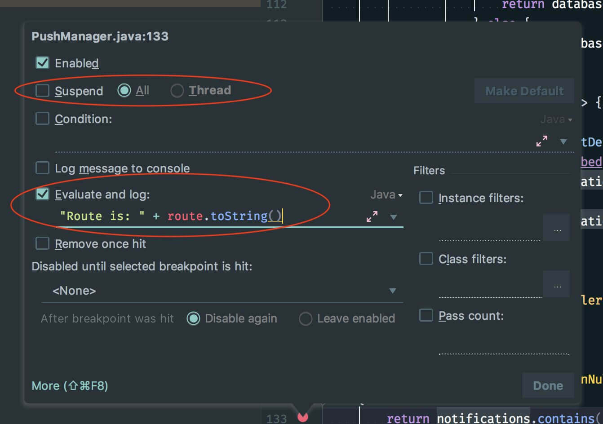

- To measure how long a method took to execute, you can use `TimingLogger` class. [[Ref Link](https://developer.android.com/reference/android/util/TimingLogger)]

  - Typical Usage
    ```java
    TimingLogger timings = new TimingLogger(TAG, "methodA");
    // ... do some work A ...
    timings.addSplit("work A");
    // ... do some work B ...
    timings.addSplit("work B");
    // ... do some work C ...
    timings.addSplit("work C");
    timings.dumpToLog();
    ```
  - Output
    ```
    D/TAG     ( 3459): methodA: begin
    D/TAG     ( 3459): methodA:      9 ms, work A
    D/TAG     ( 3459): methodA:      1 ms, work B
    D/TAG     ( 3459): methodA:      6 ms, work C
    D/TAG     ( 3459): methodA: end, 16 ms
    ```

- If you're working with Android Things and you don't have an extrenal screen for your device, install [scrcpy](https://github.com/Genymobile/scrcpy) and use it to see what's going on your Android IoT device. It works a charm over wireless adb. [[Ref Link](https://twitter.com/Tunji_D/status/1019985858575978497)]

- Android Studio has this weird behaviour that it allows to edit its default code style, which leads to a weird side-effect. If you open your pre-setup project(with set codestyle and copyright configs) in Android Studio it will delete all pre-setup codestyle and copyright profile in this project. This is every much evident if you checked in your configs into git for sharing purpose, which is lost immediately as soon as you open the project

  ```bash
  deleted:    .idea/codeStyles/Project.xml
  deleted:    .idea/codeStyles/codeStyleConfig.xml
  deleted:    .idea/copyright/profiles_settings.xml
  deleted:    .idea/copyright/copyright.xml
  ```

  To fix that please follow along as below: [All thanks to [Said Tahsin Dane](https://twitter.com/tasomaniac) for the solution]

  - We first need to verify that your `Default` codestyle isn't modified. To check that please open Android Studio with any project except your pre-setup(with set codestyle and copyright configs) project. Then navigate to `Preferences>Edior>Codestyle` and check if your code scheme has `Default` in **BLUE** color (this means it is modified).

    

  - However if it is not colored **BLUE**, you are good and you can go ahead to open your pre-setup(with set codestyle and copyright configs) project and everything should be pre-setup for you.

  - If it is modified (colored **BLUE**), then click on the cog icon and select `Restore Default`

    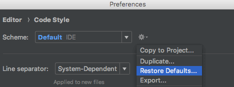

  - After you hit that option, simply accept the change

    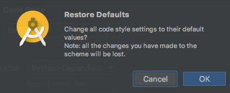

  - Once done, you will see your Default is no more colored **BLUE** or modified, which means you are good

    

  - Now simply go ahead and open your pre-setup(with set codestyle and copyright configs) project and everything should be pre-setup for you.

- If you add `android:sharedUserId` to an already published app, the app data will be cleared for all users that install your upgrade (because Android changes the process). So if you ever intend to use it, you must add it before publishing your app [[Ref Link](https://twitter.com/molsjeroen/status/1022840282012966912)]

- When opening up methods for testing, use otherwise to still hide it from code complete.[[Tweet Link](https://twitter.com/molsjeroen/status/996684391891038208), [Ref Link](https://plugins.jetbrains.com/plugin/9952-visiblefortesting)]

  

- You can group your recent Android Studio projects, and add icons to them [[Ref Link](https://twitter.com/Flashmasterdash/status/996309558120402954/photo/1)]

  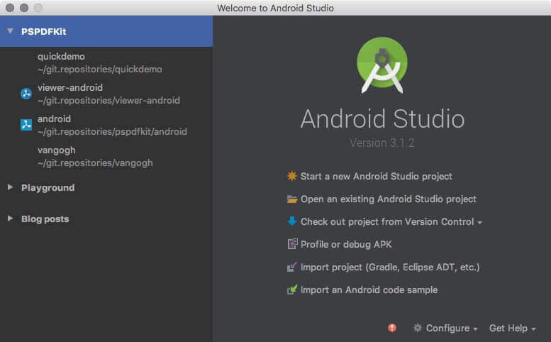

- Only build a single configuration to speed up debug builds. [[Ref Link](https://twitter.com/molsjeroen/status/973615936279281666)]

  

- Avoid the annoying jump to Design tab while editing XML. Prefer XML editor under Settings [[Ref Link](https://twitter.com/rakshakhegde/status/907913497115160576)]

  

- Reduce installed app size with `android:extractNativeLibs="false"` in <application> [[Tweet Link](https://twitter.com/molsjeroen/status/819457612005736448), [Ref Link](https://medium.com/@wkalicinski/smallerapk-part-8-native-libraries-open-from-apk-fc22713861ff)]

  

- Run a single unit test from the command line using the `--tests` option e.g: `./gradlew testDebugUnitTest --tests "*.MainPresenterTest"` . Use `*` to avoid typing the entire package name. [[Ref Link](https://twitter.com/molsjeroen/status/976469806068256769)]

- Improve Android Studio code inspections with Thread annotations [[Tweet Link](https://twitter.com/molsjeroen/status/989447750176706560), [Ref Link](https://developer.android.com/studio/write/annotations#thread-annotations)]

  

- Use `adb` to put a phone into doze mode for testing [[Tweet Link](https://twitter.com/molsjeroen/status/872007858300362752), [Ref Link](https://developer.android.com/training/monitoring-device-state/doze-standby#testing_doze)]

  

- Get faster gradle builds by only using one resource configuration for your development builds [[Ref Link](https://developer.android.com/studio/build/optimize-your-build#reduce_resources)]

  ```
  android {
    ...
    productFlavors {
      dev {
        ...
        // The following configuration limits the "dev" flavor to using
        // English stringresources and xxhdpi screen-density resources.
        resConfigs "en", "xxhdpi"
      }
      ...
    }
  }
  ```

- Use `areNotificationsEnabled()` from `NotificationManagerCompat` to detect whether your users blocked your Notifications [[Tweet Link](https://twitter.com/tasomaniac/status/851888395152392193), [Ref Link](<https://developer.android.com/reference/androidx/core/app/NotificationManagerCompat.html#areNotificationsEnabled()>)]

  

- `Activity.runOnUiThread` is just a convenient wrapper of `Handler.post`; don't pass around `Activity` just so you can use it. [[Ref Link](https://twitter.com/devunwired/status/193385939115053056)]

- Define your interfaces with the highest possible option that will suffice. Don't use an `Activity` when a Context will do. [[Ref Link](https://twitter.com/devunwired/status/193102514047041538)]

- If you're not building a replacement for the dialer, use `ACTION_DIAL` _not_ `ACTION_CALL` to initiate a call. [[Ref Link](https://twitter.com/kdarty/status/20971150330)]

- Specifying `buildToolsVersion` in your build.gradle files is optional when using Android plugin 3.0.0 or later. By default the plugin uses the minimum version of the build tools required by the version of the plugin you're using. [[Tweet Link](https://twitter.com/nisrulz/status/976730548084211718), [Ref Link](https://google.github.io/android-gradle-dsl/current/com.android.build.gradle.LibraryExtension.html#com.android.build.gradle.LibraryExtension:buildToolsVersion)]

  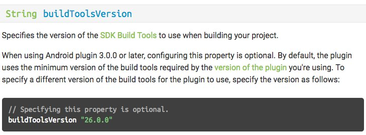

- You can insert variables into AndroidManifest defined in `build.gradle` [[Tweet Link](https://twitter.com/jabbar_jigariyo/status/910754663925899264), [Ref Link](https://developer.android.com/studio/build/manifest-build-variables)]

  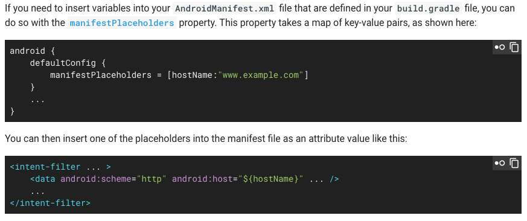

- Requesting updates from a system service may drain battery, so register for updates in onResume and unregister in onPause. [[Ref Link](https://twitter.com/nisrulz/status/818356887041118208)]

- Hierarchy Viewer won’t run on prod devices, if however u want to run it then follow below steps [[Tweet Link](https://twitter.com/nisrulz/status/800016465805983744), [Ref Link](https://developer.android.com/studio/profile/hierarchy-viewer#setup)]

  

- Variable and `init` block declaration order in Kotlin, actually matters :) if you want to use a variable inside init {} initialize it before it.

- When comparing intents it does _not_ compare any extra data included in the intents [[Tweet Link](https://twitter.com/scottyab/status/388393250286870529), [Ref Link](<https://developer.android.com/reference/android/content/Intent#filterEquals(android.content.Intent)>)]

- To show a ringtone picker to the user, use the `ACTION_RINGTONE_PICKER` intent to launch the picker as a subactivity. [[Ref Link](https://twitter.com/pareshmayani/status/359390161399853056)]

- Want to remove focusState on an item in GridView? Try: `android:listSelector="#00000000"` [[Ref Link](https://twitter.com/BSkretting/status/176655811899166721)]

- You can generate the **proguard** keep rules via the APK Analyzer inside Android Studio. [[Ref Link](https://medium.com/androiddevelopers/troubleshooting-proguard-issues-on-android-bce9de4f8a74)]

  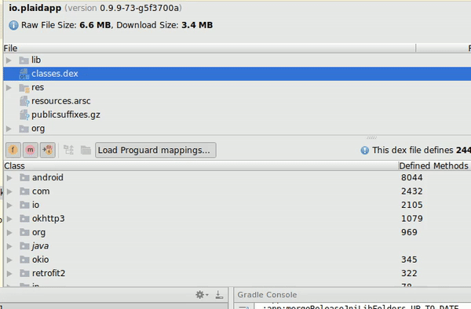

- When viewing an Android Manifest, there is a tab at the bottom that allows you to see the merged manifest. Use this to inspect the merged manifest and find conflicts. [[Ref Link](https://developer.android.com/studio/build/manifest-merge#inspect_the_merged_manifest_and_find_conflicts)]

  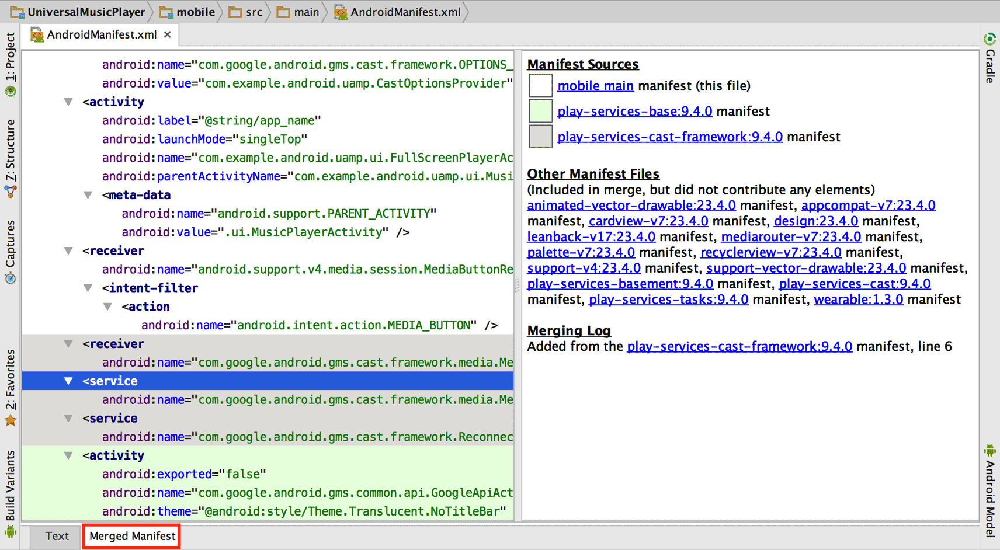

- In the APK analyzer in Android Studio, classes/members listed in italic are only references, not definitions. If it's in italics, it's defined in another DEX file (or the SDK). [[Ref Link](https://twitter.com/jebstuart/status/1093502138943197191)]

  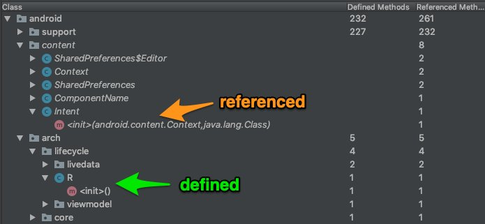

- To be able to write multiline Todo comments, simply indent by 1 tab from second line onwards. [[Ref Link](https://twitter.com/Saketme/status/1156667576946253825)]

  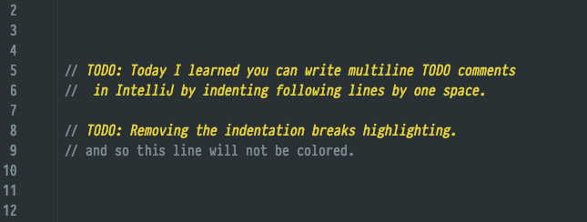

- You can get rid of a lot of noise in the Logcat, by Right Clicking a selected text > "Fold lines like this" option!. [[Ref Link](https://twitter.com/nisrulz/status/1197253137683357698)]

  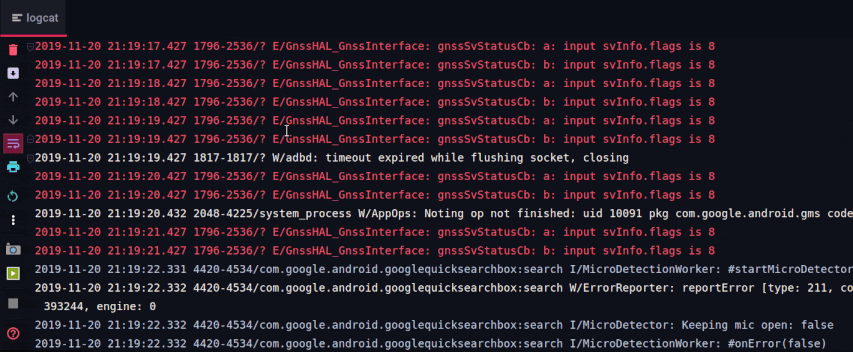

- There is a quick way to surround your layout with a Linear Layout via using a Live Template. You can create one called `wrapll` by setting it up [[Ref Link](https://twitter.com/nisrulz/status/1197666095886454789)]

  
  

  ...and use it as below

  

  > You can create more based on your usecase :smile:

- You know how you can group ur code inside IDEs such as Android Studio and IntelliJ IDEA by using the `region` and `endregion` comment blocks. Turns out you can use the same trick to group inside XML files such as for layout, strings, styles, colors xml files [[Ref Tweet](https://twitter.com/nisrulz/status/1271954906015023104)]
  
    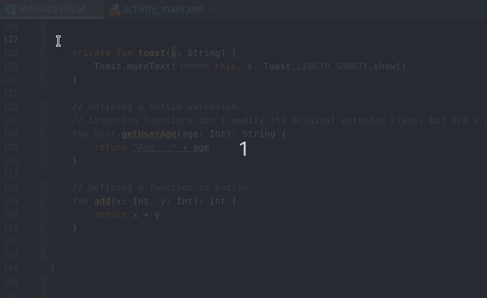
